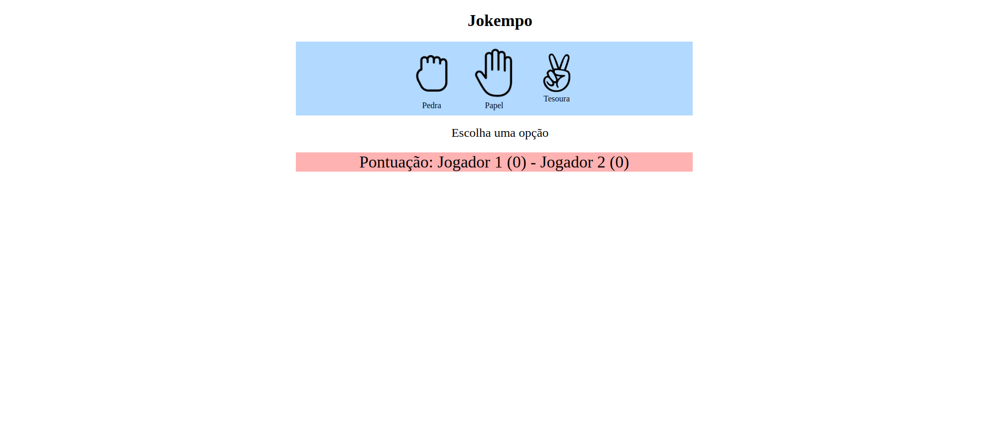

 <h1 align="center">   Jokempo  </h1>



<p align="center">
<a href="#-tecnologias">Tecnologias</a>   |   
<a href="#-projeto">Projeto</a>   |   
<a href="#-layout">Layout</a>   |   
<a href="#-como-executar">Como executar</a>
</p>

## ✨ Tecnologias


Esse projeto foi desenvolvido com as seguintes tecnologias: 

- HTML e CSS
- JavaScript


----------------

## 💻 Projeto
  O Jokempo é um projeto simples entre 2 jogadores,você contra a maquina,o objetivo é simples quem ganhar soma 10 pontos na pontuação e vai acumulando até parar de jogar,se empatar não recebe nada.
----------------

 ## 👀 Surge
  Você pode visualizar o site  através [desse link]() 
	<br>
	OBS: Indisponivel no momento

----------------

## 🚀 Como executar
 Clonar o repositório:
```git
  git clone https://github.com/nicksoto1/Jokempo.git

```
 Acessar o repertório:

```shell
 cd Jokempo

```

```shell
 code .

```

## ✒️ Author
  <a href="https://github.com/nicksoto1"> </a>

 <b>Michael Soto</b></a> <a href="https://github.com/nicksoto1">🚀</a>
 <br />